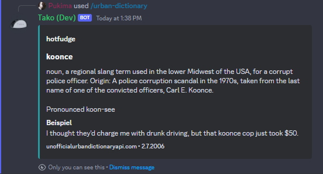
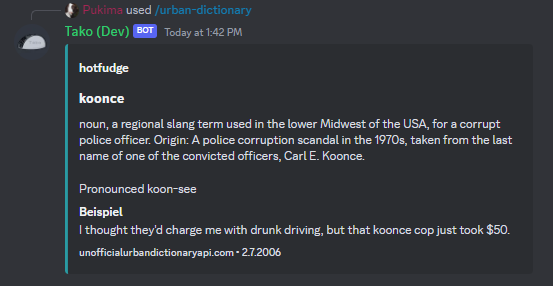

import { Tabs, TabItem } from '@astrojs/starlight/components';

With `/urban-dictionary`, you can serach for the definition of a word using data from Urban Dictionary.

## Usage

<Tabs>
	<TabItem label="Slash Commands">
		<code>/urban-dictionary</code>
	</TabItem>
</Tabs>

## Options
<Tabs>
    <TabItem label="Term">
        The term to search for.

        **Example**:
		koonce
    </TabItem>
	<TabItem label="Strict">
        Whether to use strict mode or not. The default is `false`.

        **Example (`true`)**:
		Returns only "bigger" and not "biggering", "biggered".
    </TabItem>
	<TabItem label="Match Case">
        Whether the results need to match the casing of the term. The default is `false`.

        **Example (`true`)**:
		Just returns results for "hEllO" and not "hello".
    </TabItem>
	<TabItem label="Ephemeral">
        Whether to send the response as an ephemeral message (only visible to you). The default is `false`.

        **Example (`true`)**:
		
    </TabItem>
</Tabs>

## Output

This command will show you a simple embed with the result from Urban Dictionary. It will show the definition, example, and the author of the definition. If there are multiple definitions, it will show the first one, unless you selected a specific one using autocomplete.
