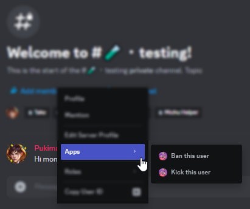

A Context Menu is a menu that appears when you right click on a user or a message. They are used to quickly access certain commands or actions.

## User Context Menu

### Desktop
You can access it by right-clicking on a user's name, or avatar in the chat. You can also access the menu by right-clicking on a user in the member list.

### Mobile
You can access it by long-pressing on a user's name, or tapping an avatar in the chat. You can also access the menu by long-pressing on a user in the member list.
